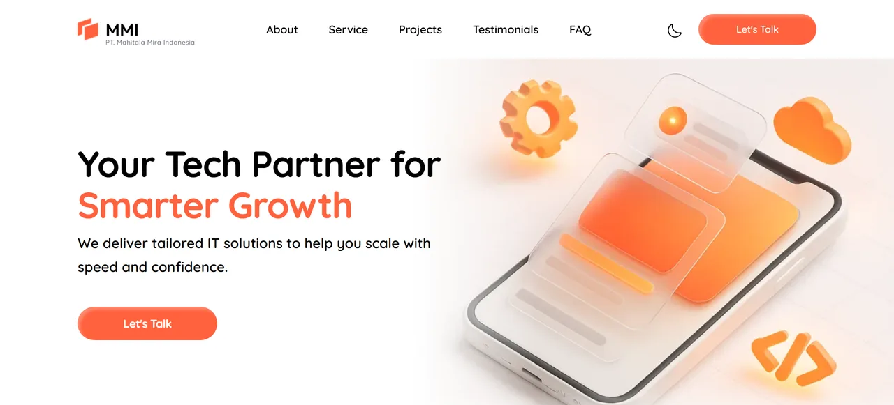

# Company Profile

[](https://github.com/Yusuf-98/Company-Profile-by-Yusuf-AR/actions/workflows/ci.yml)

A responsive, animated company-profile landing page built from a Figma design — Hero, About, Service, Projects, Testimonials, FAQ, and Footer sections, with a light/dark theme toggle.

🚀 **Live demo:** https://company-profile-by-yusuf-ar.vercel.app/


## Features

- Pixel-accurate implementation of a Figma design, responsive from mobile to desktop
- Sections: Hero, About, Service, Projects, Testimonials, FAQ, Footer
- Animated stat counters and a light/dark theme toggle
- Portfolio and service cards open a detail modal (image preview / description, highlights, metrics) with full keyboard support — scroll lock, focus trap, focus return, Escape to close
- Industry switcher follows the ARIA tabs pattern: roving tabindex, arrow/Home/End key navigation
- FAQ items toggle with `aria-expanded`, keeping only one answer open at a time
- Component-based architecture with reusable UI pieces

## Screenshots

| Dark theme | Light theme |
| --- | --- |
|  |  |

| Animated stat counters | Testimonial carousel | FAQ |
| --- | --- | --- |
|  |  |  |

## Tech stack

- **React 19** + **TypeScript** + **Vite**
- **Tailwind CSS v4** for styling
- **Vitest** + **React Testing Library** for tests, **GitHub Actions** for CI
- **ESLint** for linting

## Getting started

```bash
git clone https://github.com/Yusuf-98/Company-Profile-by-Yusuf-AR.git
cd Company-Profile-by-Yusuf-AR
npm install
npm run dev
```

Open `http://localhost:5173` in your browser.

| Command | Description |
| --- | --- |
| `npm run dev` | Start the Vite dev server |
| `npm run build` | Type-check (`tsc -b`) and build for production |
| `npm run lint` | Run ESLint |
| `npm run preview` | Preview the production build |
| `npm run test` | Run tests in watch mode |
| `npm run test:run` | Run the test suite once |

## Testing

Tests live next to the code they cover (`*.test.tsx`) and run with Vitest and React Testing Library in jsdom. They target interactive logic rather than static markup:

- **Button**: variants, click handling, disabled state
- **Theme toggle**: default theme, persistence of the `dark` class, and the context throwing outside its provider
- **FAQ accordion**: default open item, only one item open at a time, closing on repeat click
- **Portfolio preview modal**: opens with the right image/category/label, closes via the close button, backdrop click and Escape
- **Service detail modal**: opens with the description, highlights and metrics; swapping between services; closing on Escape
- **Modal accessibility hook**: scroll lock, focus moved in and returned to the trigger, Tab trapped inside the modal (including Shift+Tab), Escape closes it
- **Error boundary**: renders children normally, shows the fallback UI when a child throws, and the reload button
- **Contact form**: every field's label is linked to its input, a required-field error appears for each empty field on submit, an error clears once its field is filled in, and a valid submission shows the success popup

GitHub Actions runs lint, type-check, tests and the production build on every push and pull request ([ci.yml](.github/workflows/ci.yml)).

## Performance

- Below-the-fold images use `loading="lazy"`; the hero image and nav logo stay eager since they're always in the initial viewport
- The portfolio preview, service detail, and contact form success/failure modals are code-split with `React.lazy` + `Suspense`, so their JS only loads when a user actually opens one
- The industry switcher's image has a fixed `aspect-ratio` and fades in on `onLoad`, so switching tabs never shifts the layout while the next image loads

## Project structure

```
src/
├── assets/           # Images, icons and logos
├── components/
│   ├── layout/       # Navbar, Footer
│   ├── sections/     # Page sections (Hero, About, Service, Portfolio, ...)
│   └── ui/           # Reusable UI pieces (cards, modals, form fields, ...)
├── context/          # Theme context and provider
├── data/             # Static content per section
├── hooks/            # useCountUp, useModalA11y
├── pages/            # Home
├── test/             # Vitest setup
└── types/            # Shared types
```

## Deployment

Deployed on Vercel, auto-deploying from `main`. It's a fully static build with no environment variables or routing config to set up.

## Author

Built by [Yusuf AR](https://github.com/Yusuf-98).

## License

Licensed under the [MIT License](LICENSE).
