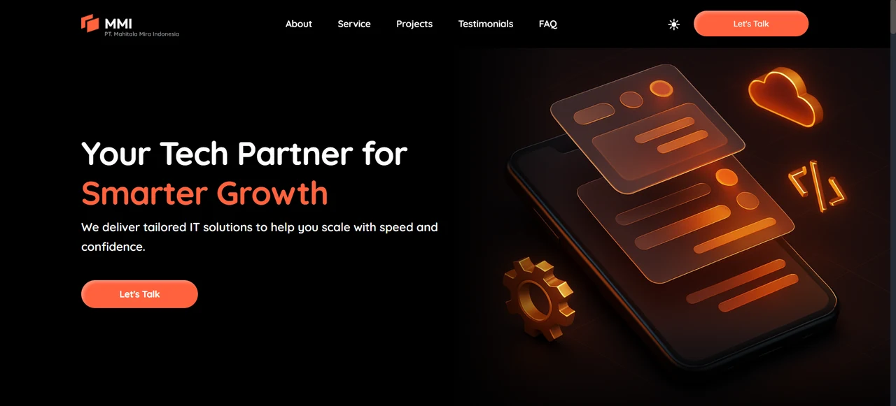
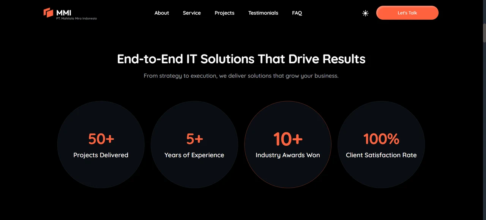
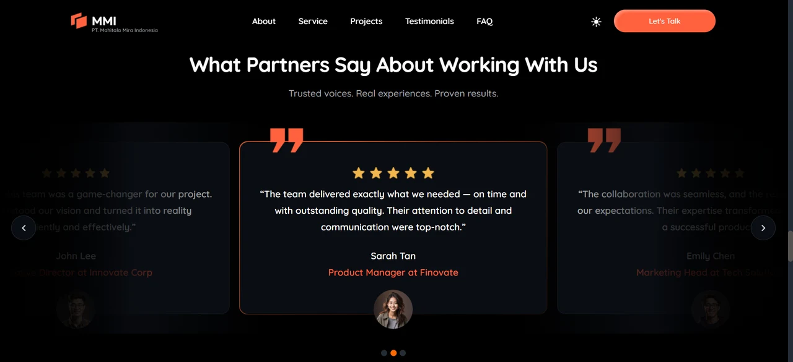
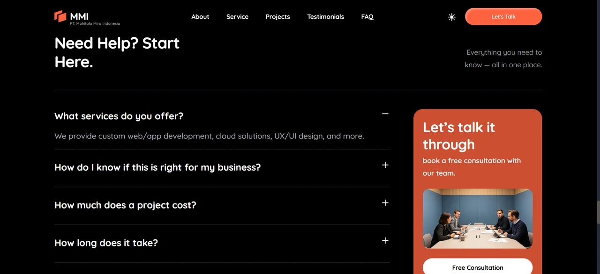

# Company Profile

[](https://github.com/Yusuf-98/Company-Profile-by-Yusuf-AR/actions/workflows/ci.yml)

A responsive, animated company-profile landing page built from a Figma design — Hero, About, Service, Projects, Testimonials, FAQ, and Footer sections, with a light/dark theme toggle.

🚀 **Live demo:** https://company-profile-by-yusuf-ar.vercel.app/




## Screenshots

| Animated stat counters | Testimonial carousel | FAQ |
| --- | --- | --- |
|  |  |  |

## Features

- Pixel-accurate implementation of a Figma design, responsive from mobile to desktop
- Sections: Hero, About, Service, Projects, Testimonials, FAQ, Footer
- Animated stat counters and light/dark theme toggle
- Component-based architecture with reusable UI pieces

## Tech Stack

- React 19 + TypeScript
- Vite
- Tailwind CSS v4
- ESLint
- Vitest + React Testing Library

## Getting Started

```bash
git clone https://github.com/Yusuf-98/Company-Profile-by-Yusuf-AR.git
cd Company-Profile-by-Yusuf-AR
npm install
npm run dev
```

Open `http://localhost:5173` in your browser.

## Testing

```bash
npm run test:run
```

Runs the Vitest suite once (component rendering, the theme toggle, and the FAQ accordion). Use `npm run test` for watch mode.

## Author

Built by [Yusuf AR](https://github.com/Yusuf-98).

## License

Licensed under the [MIT License](LICENSE).
